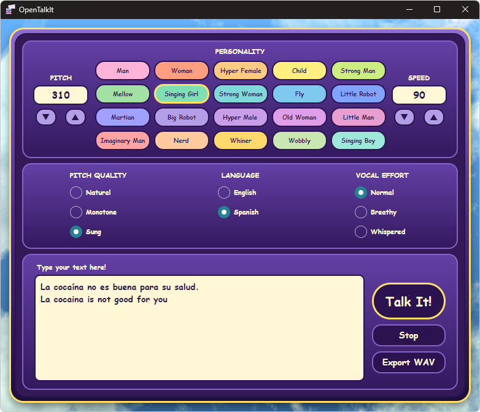

# OpenTalkIt

An open-source reimplementation of the **Microsoft Talk It!** frontend, built with Avalonia UI and .NET 10.

Talk It! was a Windows speech synthesis application from the 1990s powered by the SoftVoice engine (`TIBASE32.DLL`). OpenTalkIt recreates its UI and behaviour as a modern cross-architecture desktop app, using the portable **TalkIt_OSS** speech engine through the companion **TiSpeech** library.



## Features

- 20 voice personalities with per-personality presets (pitch, speed, pitch quality, vocal effort) matching the original application
- Pitch quality control: Natural / Monotone / Sung
- Vocal effort control: Normal / Breathy / Whispered
- Language switching: English / Spanish (German supported by the engine)
- Pitch and speed adjustable per personality
- Async speech with Stop support
- Direct WAV export from the synthesized audio

## Requirements

| Requirement | Detail |
|---|---|
| OS | Windows x64, macOS arm64/x64, Linux x64, Android 6.0+ (arm64, x86_64 emulators) |
| .NET | Release zips are self-contained; source builds use .NET 10 |
| Native build | CMake and a C compiler; extracted speech data lives in the sibling `TalkIt_OSS` repo |
| Linux playback | `paplay` (pulseaudio-utils) or `aplay` (alsa-utils); export works without them |

The Avalonia app uses the portable native engine for English/Spanish speech,
phoneme preview, personality and voice settings, and direct WAV export on every
platform. Windows playback uses NAudio; macOS/Linux use the system audio player.
Original Talk It! DLLs and an x86 host are not required.

## Getting Started

### Prebuilt zips

The portable native engine now includes extracted English and Spanish speech
data from the sibling `TalkIt_OSS/data` directory. Builds from this source no
longer need original DLLs or Python for native synthesis and phoneme conversion.
Older release archives may still require the original DLLs.

The original Windows backend is an optional fallback: build with
`-p:IncludeLegacySpeechHost=true` and provide its DLLs in the app's `x86` folder.

### From source

1. Clone the repo
2. Check out `TalkIt_OSS` alongside `TiSpeech` and install CMake and a C compiler.
   No original DLLs or Python are needed.
3. Build and run:

```
dotnet run --project OpenTalkIt/OpenTalkIt.csproj
```

### Android

No Android Studio and no NDK. `dist/setup-android.sh` installs a private
toolchain in `~/.cache/opentalkit-android` (a .NET 10 SDK with the android
workload, OpenJDK 17, and only the Android SDK platform/build tools); delete
that folder to uninstall. Then:

```
dist/build-android.sh     # -> dist/zips/OpenTalkIt-android.apk
adb install -r dist/zips/OpenTalkIt-android.apk
```

`libtispeech.so` is cross-compiled with zig: it needs nothing beyond plain libc
calls, whose ABI musl and Android's bionic share, so zig's musl target links it
against bionic's `libc.so` directly. The same project builds the APK
(`-p:OpenTalkItAndroid=true -f net10.0-android`); `Platforms/Android` holds the
activity and an `AudioTrack` player. Below 600 px wide the UI switches to a
portrait layout. The APK is signed with the local debug key, which is fine for
sideloading.

## Project Structure

The solution spans five sibling repositories:

```
TiSpeech/              Engine contracts and P/Invoke bindings
TalkIt_OSS/            Portable native engine, extracted speech data and verification tools
TiSpeech.Client/       Named-pipe client that talks to TiSpeech.Host
TiSpeech.Host/         32-bit out-of-process host that loads TIBASE32.DLL
OpenTalkIt/            Avalonia UI application (this repo)
  Models/
    PersonalityButtonModel.cs   Per-personality button state
    PersonalityPreset.cs        Preset record (pitch, speed, pitch quality, vocal effort)
    PersonalityPresets.cs       Static lookup table of OG Talk It! presets per personality
    Records.cs                  TalkParameters — snapshot of all settings passed to the engine
  ViewModels/
    MainWindowViewModel.cs      Composition root; wires preset application on personality change
    PersonalityControlViewModel Personality grid + pitch/speed controls
    ParameterControlViewModel   Pitch quality, vocal effort, language
    TalkControlViewModel        Text input, Talk/Stop/Export commands
  Views/Controls/
    PersonalityControl.axaml    4×5 personality grid with pitch and speed inputs
    ParameterControl.axaml      Radio button groups for pitch quality, vocal effort, language
    TalkControl.axaml           Text box and Talk It! / Stop / Export buttons
  Services/
    WavRecorder.cs              WASAPI loopback capture for WAV export
    Settings.cs                 JSON settings persistence (%APPDATA%/OpenTalkIt/)
```

## TiSpeech Library

TiSpeech binds the portable `libtispeech` library built by `TalkIt_OSS`. The app
selects `NativeTiSpeechBackend` first and plays its PCM through a platform audio
player. WAV export writes that PCM directly without recording or muting system
audio. The original Windows engine, exposed by `TiSpeechClient` and the x86
`TiSpeech.Host`, remains an opt-in compatibility fallback.

See [`TiSpeech/TiSpeech.md`](https://github.com/glebasos/TiSpeech/blob/master/TiSpeech.md) for the full API reference.

### Key enums

| Enum | Controls |
|---|---|
| `TiPersonality` | Voice character (0–19) |
| `TiVoicingMode` | Vocal effort: Normal / Breathy / Whispered |
| `TiF0Style` | Pitch contour: Natural / Monotone / Sung / Whispered-style |
| `TiSpeakingMode` | Token interpretation: Natural / Word / Spell / Number |
| `TiLanguage` | Runtime language switch |

## WAV Export

Since SoftVoice exposes no file-export API, WAV export works by capturing the system audio output (WASAPI loopback) while speech is playing. The captured audio is written to a WAV file at a location chosen via a save-file dialog. The last-used export folder is persisted in `%APPDATA%/OpenTalkIt/settings.json`.

## Reverse Engineering Notes

The preset values and engine parameter mappings were confirmed through a combination of Ghidra static analysis of `TIBASE32.DLL` and dynamic analysis (API Monitor + x32dbg breakpoints) of the original Talk It! application.

Notable findings:
- **Vocal effort** (Normal / Breathy / Whispered) is controlled by `SVSetVoicingMode` (values 0–2), **not** `SVSetGlottalSource` as the internal string table might suggest
- **Pitch quality** (Natural / Monotone / Sung) maps to `SVSetF0Style` values 0 / 2 / 4
- `SVSetGlottalSource` is present in the DLL but is not called by the original UI's Vocal Effort buttons

## License

The original DLLs are not shipped. The portable engine includes extracted
SoftVoice speech data; see `TalkIt_OSS/data/README.md` for its provenance and
regeneration workflow.
